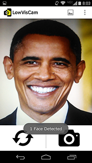
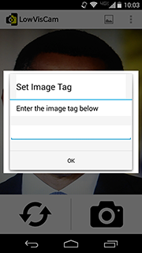
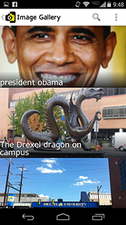

# LowVisCam
Android Camera &amp; Image Tagging Application for Low Vision and Blind users

##YouTube

##Screenshots
...

##Contributing Sources
- Samuel White, Hanjie Ji, and Jeffrey P. Bigham. 2010. EasySnap: real-time audio feedback for blind photography. In Adjunct proceedings of the 23nd annual ACM symposium on User interface software and technology (UIST '10). ACM, New York, NY, USA, 409-410. 
- Chandrika Jayant, Hanjie Ji, Samuel White, and Jeffrey P. Bigham. 2011. Supporting blind photography. In The proceedings of the 13th international ACM SIGACCESS conference on Computers and accessibility (ASSETS '11). ACM, New York, NY, USA, 203-210.
- Jeffrey P. Bigham, Chandrika Jayant, Hanjie Ji, Greg Little, Andrew Miller, Robert C. Miller, Robin Miller, Aubrey Tatarowicz, Brandyn White, Samual White, and Tom Yeh. 2010. VizWiz: nearly real-time answers to visual questions. In Proceedings of the 23nd annual ACM symposium on User interface software and technology (UIST '10). ACM, New York, NY, USA, 333-342.
- http://www.aph.org/products/aphont/
- http://webaim.org/articles/visual/lowvision

##Future Work
- Card interface for image gallery
- Swipe to delete photos
- Bounding box for face detected in CameraPreview
- Better saved image orientation
- Image viewer zoom, rotation, and animations
